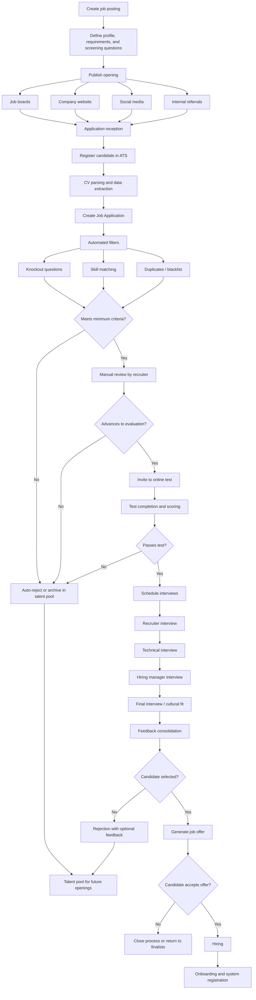

# LTI — ATS Project Brief

LTI is a startup that wants to develop an ATS (Applicant Tracking System).
Among the functions an ATS performs are:

- Creating job postings (jobs)
- Publishing jobs on boards, websites, social media, etc.
- Receiving applications to said jobs from applicants
- Reviewing job applications
- Conducting online tests for candidates
- Scheduling interviews
- Selected candidates are hired.

## Strategic Objectives

LTI wants to define the key features that differentiate it from its main competitors. Among its objectives are:

1. **Increase operational efficiency** of HR teams by reducing manual tasks and administrative overhead in the recruitment process.
2. **Improve real-time collaboration** between recruiters, hiring managers, and other process participants through a centralized, traceable, and shared workflow.
3. **Automate key pipeline stages** to accelerate time-to-fill and increase the scalability of the talent acquisition function.
4. **Integrate AI capabilities** that support job description writing, candidate evaluation, prioritization, and tracking.
5. **Provide actionable analytics** to optimize decision-making and identify improvement opportunities at each stage of the process.
6. **Deliver a better experience** for both candidates and internal teams through faster, more consistent, and more transparent processes.